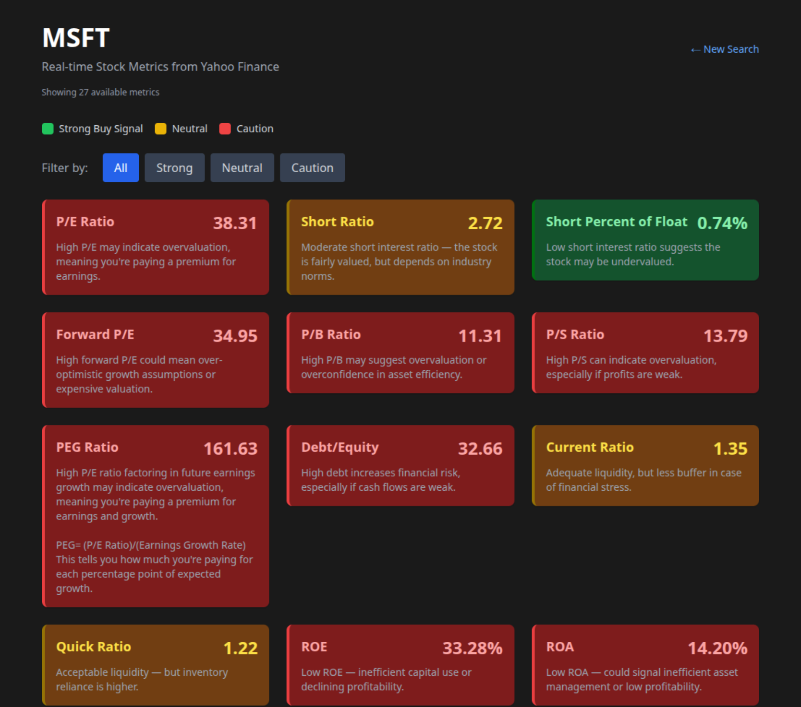
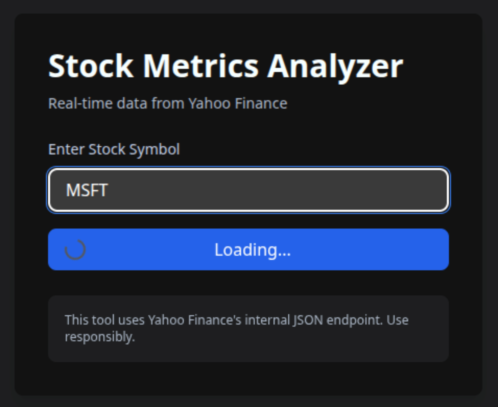

# Stock Analysis Service
This provides very rudimentary evaluation of a stock ticker.

A golang stock service that can run on a headless server. This includes building, archiving, packaging, and running on a debian/ubuntu arm or amd server.

This is an excellent fully running scaffolding / skeleton to build your own golang application on.

- Creates debian packages that run on arm64 and amd64 (Works on Oracle ARM free-tier, Google Cloud, Vultr, etc)
- Creates source archives and carries it with the binary for understanding what code is running on the server.
- Has versioning in a golang file that the build scripts use so the main file can also know it's version.
- Creates the necessary ufw, systemd, logrotate files to make the service automatically start and reload.
- Uses systemd watchdog to ensure the service doesn't get stuck.

# Screenshots of the service running:





- Note: Loading can take a few seconds due to using free parsing of Yahoo pages, and requires running a headless chromium browser to gain proper access to these in-detail metrics for free.

# Instructions

## Install on cloud/remote SSH machine

``` bash
SERVER=myfqdn or IP address

./cmd/stock/build.sh && scp -r cmd/stock/stock_1.0.0.deb ${SERVER?}: && ssh ${SERVER?} "sudo apt-get -y remove stock && sudo dpkg -i stock_1.0
.0.deb"```
